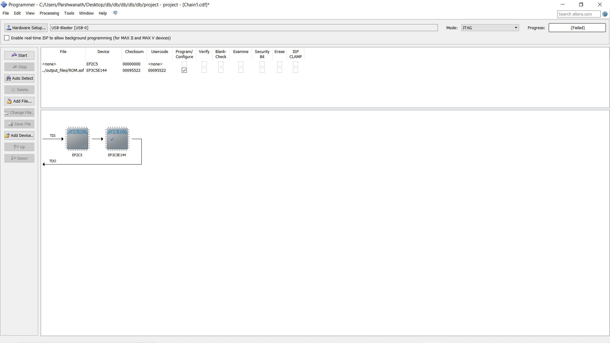

# Experiment-11-programming-logic-device-s-FPGA-BOARDS-
 ### AIM:
 
 To understand the standard procedure to interface an FPGA board and flashing method using usb blaster 
 
### HARDWARE REQUIRED: 

– PC, Cyclone II , USB flasher

### SOFTWARE REQUIRED: 

Quartus prime

### THEORY 

### Procedure 

Start the Quartus II Programmer.

Click Add File and select the path to the desired .sof.

Turn on the Program/Configure option for the added file.

Click Start to download the selected file to the FPGA. Configuration is complete when the progress bar reaches 100%.
 

### RESULTS 

